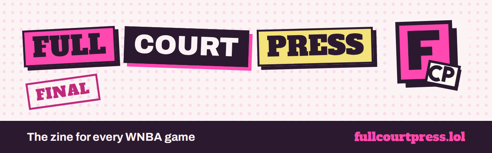

# Full Court Press



[](https://github.com/earlgreyhot1701D/full-court-press/actions/workflows/tests.yml)  

**The zine for last night's WNBA games.** Every finished game gets an issue, written from **each team's side**, not just the winner's, in two voices, with a share card, a 10-second audio recap, and a print button that folds the issue into an 8-panel pocket zine.

| | |
|---|---|
| **Live site** | https://fullcourtpress.lol |
| **Golden set** (five real games, always up, for judges) | https://fullcourtpress.lol/golden/index.html |
| **Built for** | AWS Builder Center "Zero to Shipped" hackathon, September 2026 |
| **Status** | MVP. WNBA only; a new issue every morning after games |

Unofficial fan project. Not affiliated with, endorsed by, or associated with the WNBA, any team, or our data provider. Data from [BALLDONTLIE](https://www.balldontlie.io).

**Contents:** [Architecture](#architecture) . [How it's made](#how-its-made) . [Honest limitations](#honest-limitations) . [Tech stack](#tech-stack) . [Repo map](#repo-map) . [Run it locally](#run-it-locally) . [Cost](#cost) . [Stubs](#stubs-not-built-on-purpose) . [License](#license)

---

## Architecture

One scheduled Lambda does everything, then gets out of the way. Readers only ever touch static files behind CloudFront.

```
                                ┌──────────────────────────┐
                                │  EventBridge Scheduler   │  6:15am Pacific, daily
                                └────────────┬─────────────┘
                                             │ invoke
                                             ▼
 ┌───────────────┐  API key   ┌──────────────────────────────┐   game list,    ┌──────────────┐
 │ SSM Parameter │ ─────────► │   Lambda: fcp-hunter         │ ◄────────────── │ BALLDONTLIE  │
 │ Store (secret)│            │   python 3.13                │  play-by-play,  │ (WNBA data)  │
 └───────────────┘            │                              │  standings      └──────────────┘
                              │  1. find last night's finals │
                              │  2. count stats from plays   │  code
                              │  3. facts sheet + plain_facts│  code
                              │  4. write the voices ────────┼──► Amazon Bedrock
                              │     fact lock, retry, drop   │    (Claude Haiku 4.5, via an
                              │  5. share card (Pillow)      │     application inference profile)
                              │  6. audio recap ─────────────┼──► Amazon Polly (neural)
                              │  7. render static pages      │
                              └──────────────┬───────────────┘
                                             │ put objects
                                             ▼
                              ┌──────────────────────────────┐
                              │  S3 (private, no public URL) │  pages, cards, mp3, state
                              └──────────────┬───────────────┘
                                             │ Origin Access Control
                                             ▼
 ┌───────────────┐            ┌──────────────────────────────┐
 │ ACM cert      │ ─────────► │  CloudFront                  │  CSP, HSTS, nosniff,
 │ (us-east-1)   │            │                              │  frame DENY, referrer policy
 └───────────────┘            └──────────────┬───────────────┘
                                             │  fullcourtpress.lol (DNS at Porkbun)
                                             ▼
                                         the reader

 Side rails: CloudWatch Logs (ids, counts, lock results only) . AWS Budgets ($10 project, $2 Polly)
             . Project cost tag . everything defined in template.yaml (AWS SAM)
```

Inside the Lambda, the one rule that shapes everything: **code decides what's true, the model only decides how it sounds.**

```
play-by-play ──► pbp_stats ──► facts sheet ──► plain_facts ──► voices prompt ──► Haiku
                 (counted)     (reconciled     (claims as       (quote these,
                                to the final)   sentences)       never do math)
                                                                               │
      page  ◄── voice_view ◄── recheck at render ◄── fact lock + banned words ◄┘
                               (current rules on     (fail twice: the section
                                saved voices)         is dropped, and the page says so)
```

## How it's made

Deterministic structure, AI flavor. Code writes every number. The AI writes the voice, and code checks it.

- **Stats are counted, not bought.** The data tier this project pays for has no box score, so `pbp_stats.py` counts points, rebounds, assists, steals and blocks from the play-by-play text. Every team's points must add up to the final score or the stat line is dropped. Other categories are dropped one by one if their count cannot be trusted.
- **The fact lock** (`fact_lock.py`) rejects any number or name the model writes that is not in that game's facts sheet, spelled-out numbers included. A section that fails twice is dropped and the page says "The writers' room passed on this one."
- **plain_facts.** Human audits of live model output found the lock passing sentences whose numbers were all real but whose claims were wrong ("the fourth quarter belonged to Atlanta" when Indiana won it). The fix was not a stricter prompt. Code now writes those claims itself (who won each quarter, the score at halftime, each team run, who led each team, where the standings sit) and the model quotes them.
- **Two voices:** The Call (default) and The Film Room. Original archetypes; no real person is named or imitated.
- **Every edition:** a fan of the losing team gets her own edition, told from her side, honest about the loss.

### How the numbers are checked

Points are checked by arithmetic: they must add up to the final score, which comes from a separate record. In the golden set, 5 of 5 games reconciled, overtime included, with zero plays the counter could not attribute.

The other categories have no independent source. So I checked three counted stat lines by eye against Basketball Reference on Sep 24, including Alyssa Thomas's triple-double (15 points, 11 rebounds, 12 assists), built entirely on counted rebounds and assists. All three matched.

> A human checking an agent's counting against an outside source is the best proof of the whole approach.

What that does not prove: rebounds and assists are still counted, not verified, on any given night.

## Honest limitations

- **Unofficial data feed.** Stats are counted from play-by-play text. Points reconcile; other categories are sanity-checked, not verified. A category that fails its check is left out and the page says so.
- **The lock checks numbers and names, not meaning.** It proves every number and name came from the facts. It cannot prove a sentence uses them correctly. plain_facts make that rare; they do not make it impossible.
- **Two voices, WNBA only.** Two more voices and the NBA are stubbed (below).
- **The audio is plain.** Polly neural reads a script built by code, on purpose: the generative engine can say words that are not in the script.

## Built by two agents and a human

I direct, validate and decide. Kiro (AWS's spec-driven agent) built the spec, the spikes and everything that touches AWS: the connection, the deploy, Bedrock, Polly, the API key in Parameter Store. Claude built the application code on disk, the tests and the design passes after a Kiro credit crunch mid-sprint. Each agent logs its own work in [BUILD-LOG.md](BUILD-LOG.md), and every prompt handed to Kiro is kept in [docs/agent-prompts/](docs/agent-prompts/). Decisions and findings, including the wrong turns, are in [LEDGER.md](LEDGER.md). The deploy runbook is [DEPLOY.md](DEPLOY.md).

Security: no IAM users or access keys; the API key lives only in SSM and never passed through an agent; logs hold ids, counts and lock results only, never prompts, model text or keys; private bucket behind CloudFront OAC; CSP with no outside hosts; $10 and $2 budgets on the project tag and on Polly.

## The spikes

Before any product code existed, each risky question got a throwaway script with a pass/fail answer. They are kept in [`spike/`](spike/) as evidence that the questions got asked first. **None of it is used by the product**, and every checkpoint checked that.

| Spike | Question | Answer |
|---|---|---|
| `bdl_from_lambda.py` | Does the data API answer from an AWS Lambda, and which endpoints does the free tier allow? | Yes. Only games on the free tier; player stats, standings and plays returned 401. Led to the ALL-STAR upgrade decision. |
| `bdl_allstar_probe.py`, `bdl_routes_probe.py` | After the upgrade, is a 401 "your plan doesn't include this" or "wrong address"? | Plan, confirmed across routes. The WNBA tier table differs from the NBA one: plays and standings yes, player stats no. So stats are counted from plays. |
| `card_in_lambda.py` | Does Pillow plus a bundled font render a 1200x630 card inside Lambda? | Yes (Pillow 12.2, Python 3.13). |
| `mp3_duration.py` | Does Polly neural work in the same region, and how long is a 25-word line? | Yes. 23 words = 6.8 s, so about 30 words for a 10-second recap. |
| `golden-discovery/` | Which real 2026 games make a good golden set, including an overtime game? | Five games, one in overtime (25014). |

Each has a matching entry in [LEDGER.md](LEDGER.md) under Block 0.

## Tech stack

| Layer | Tool |
|---|---|
| Language | Python 3.13, Jinja2 templates, plain CSS (no framework, no build step) |
| Compute | AWS Lambda, triggered by EventBridge Scheduler |
| AI writing | Amazon Bedrock, Claude Haiku 4.5, Converse API |
| Audio | Amazon Polly, neural voice (Danielle) |
| Images | Pillow (share cards) |
| Hosting | S3 (private) + CloudFront (OAC), ACM certificate, custom domain |
| Secrets | SSM Parameter Store (the data API key) |
| Infra as code | AWS SAM (`template.yaml`) |
| Data | BALLDONTLIE WNBA API (paid tier: games, play-by-play, standings) |
| Tests | pytest, fully offline (fixtures, no AWS, no model calls) |

## Repo map

```
src/zine/        the app: hunter.py is the Lambda entry point
  pbp_stats.py     counts stats from play-by-play
  facts.py         facts sheet + plain_facts sentences
  voices.py        the two voices, banned words, prompts
  voice_run.py     fact lock, retry once, drop; recheck at render
  site_build.py    renders every page, card and data file
templates/       Jinja2 pages (front, issue, team, archive, about)
static/          CSS, fonts (OFL), favicon, social preview
tests/           pytest suite, offline
fixtures/        recorded API responses for tests and dry runs
spike/           Block 0 throwaway scripts (evidence, not product)
tools/           build_lambda.py (the deploy bundle), fetch helpers
design/          mockups, brand assets, favicon options
template.yaml    all AWS resources (SAM)
PRD.md           the spec: MUST / STUB / NEVER
BRANDING.md      colors, type, voice, icon
LEDGER.md        decisions and findings, including the wrong turns
BUILD-LOG.md     what each agent did, block by block
DEPLOY.md        the deploy runbook
docs/agent-prompts/  every prompt handed to Kiro, and the owner-only setup steps
.github/workflows/   tests on every push
```

## Run it locally

Needs Python 3.13. No AWS account or API key needed for tests or local renders.

macOS / Linux:

```
pip install -r requirements-dev.txt
PYTHONPATH=src:tests python -m pytest                      # 183 tests, offline
PYTHONPATH=src python -m zine.dev_render_golden            # the golden site into out-golden/
PYTHONPATH=src python -m zine.dry_run --date 2026-09-22    # the hunter on fixtures, no model, no AWS
```

Windows (PowerShell):

```
pip install -r requirements-dev.txt
$env:PYTHONPATH="src;tests"; python -m pytest
$env:PYTHONPATH="src"; python -m zine.dev_render_golden
$env:PYTHONPATH="src"; python -m zine.dry_run --date 2026-09-22
```

Deploying needs an AWS account, the AWS SAM CLI, and a BALLDONTLIE key with WNBA play-by-play access. Steps are in [DEPLOY.md](DEPLOY.md). Build the bundle with `tools/build_lambda.py`, never `sam build` (it needs Linux wheels for Pillow).

## Cost

| Item | Why it stays small |
|---|---|
| Lambda | One run a day, a few minutes at most |
| Bedrock (Haiku 4.5) | About 20 calls on a full night; voices are cached, so rebuilds cost nothing |
| Polly | One ~10-second recap per game |
| S3 + CloudFront | A static site with a handful of visitors |
| Guardrails | $10/month budget on the Project tag, $2/month on Polly, both alerting |

## Stubs (not built, on purpose)

- **NBA.** `league_config.py` has it disabled. Reactivate when the NBA regular season starts (late October 2026): enable it, add `nba` to `LEAGUES`. Same data shapes.
- **Two more voices**, The Insider and The Big Picture (`voices.py`).
- **Voice tuning** on real output, with drop rates tracked per voice.
- **One run at a time** via an S3 lock (a new account's Lambda concurrency is 10, so reserved concurrency is not possible).
- **Tip jar** on the About page.

## Credits

Data from [BALLDONTLIE](https://www.balldontlie.io). Fonts: Alfa Slab One, Archivo and Caveat, all SIL Open Font License, licenses in `static/fonts/`. The name is a hand-me-down from an old courthouse newsletter.


## License

Code: [MIT](LICENSE). The fonts keep their own SIL Open Font License (`static/fonts/`). Game data belongs to its source and is not covered by this license.

---

AI Assisted. Human Approved. Powered by NLP.
